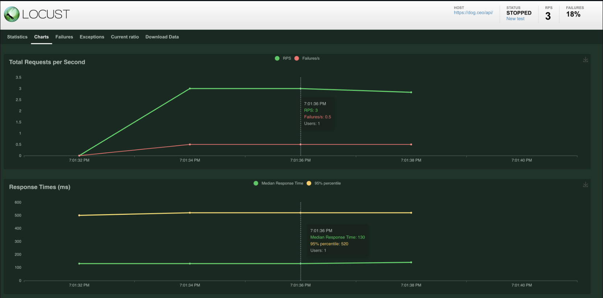

# Sdet-Architect

# Table of Contents
1. [Purpose](#purpose)
2. [Quality in the Context of Automated Software Testing](#quality-in-the-context-of-automated-software-testing)
3. [Overall Methodology in Testing Automation Structure](#overall-methodology-in-testing-automation-structure)
   1. [Test Scripts](#test-scripts)
   2. [Step Definitions](#step-definitions)
   3. [Application Control](#application-control)
   4. [External Dependencies](#external-dependencies)
4. [Web Application Testing](#web-application-software-automation)
   1. [Tool choice for Webdriver Automation](#tool-choice-for-webdriver-automation)
      1. [Free Tool: Selenium](#free-tool--selenium)
      2. [Paid Tool: Cypress](#paid-tool--cypress)
   2. [Example Projects](#example-web-automation-projects)
5. [API Testing](#api-testing)
   1. [Implementation](#implementation)
      1. [Rest](#rest)
      2. [gRPC](#grpc)
   2. [Summary](#api-summary)
6. [Mobile Testing](#mobile-and-smart-device-automation)
   1. [Appium](#appium)
      1. [Woah...](#woah-woah-woah---that-was-a-lot)
      2. [Why Bother](#so-why-bother-if-its-so-hard-to-setup)
   2. [More...?](#more)
   3. [Example Mobile Projects](#example-mobile-projects-)
6. [Performance Testing](#performance-testing)
   1. [Locust](#locust)
      1. [How does Locust work at a high level?](#how-does-locust-work-at-a-high-level)
      2. [Is it that simple](#is-it-that-simple)
   2. [Distributed Load Test](#distributed-load-testing)
      1. [Locust Distributed Load Testing](#locust-distributed-load-testing)
   3. [Sample Performance Test Project](#sample-performance-test-project)
7. [Other Important Concepts](#other-important-concepts)
   1. [Parallelization](#parallelization)
   2. [Accessibility Testing](#accessibility-testing)
      1. [pa11y](#pa11y)

## Purpose

The purpose of this project is to show the types of projects and technologies I've worked on and written pertaining to software testing.  I want to do this so I can architect Software testing solutions.

All the work here I've either written from scratch or worked within heavily, and understand to a high degree.

## Quality in the Context of Automated Software Testing

Quality in the context of Software testing is simply a standard. It's a standard we hold for our users, customers, stakeholders, ourselves, and the greater marketplace as a whole.

We can measure it in two ways: Quantitatively and Qualitatively.

- Quantitave quality refers to countable, measurable metrics: does a Web Application page load? Do I get a 200 response code from an API? etc. 

- Qualitative quality refers to standards that are subject to interpretation, and can even require intuition to understand.  One such example might be when Google/Apple smartphones initially possessed dark skin bias in smartphone. 

Further discplines of Software testing such as Security Testing and Performance testing are simply combinations of the two:  

- Performance testing tools like Locust provide quantitative response times and failure rates we need to qualitatively determine whether they pass muster
- Security tools like OWASP Quantitativly can help determine if your website is secure or not versus a qualitative standard
- Accessibility standards like WCAG are Qualitative standards executed Quantitatively

Automated Software Testing helps us organizations and departments by cutting into the time it takes us to assess our applications on a variety of levels.

---

## Overall Methodology in Testing Automation Structure

For the most part, all Software Testing Projects consist of 3 to 4 parts:


The 4 parts include Test Scripts, Step Definition, Application Control, and External Dependencies. Some tools combine all of these in one, but usually those have a cost associated with them.

Each layer should only interact within one degree of separation. For example your test scripts should not directly call your external dependencies.  This helps your project have clarity and flow not only when writing, but for maintenance in years/projects to come. 

Some tools combine Test Scripts and Step Definitions in one place.

### Test Scripts
Test Scripts define what your tests will do and how they will run. For example, if you have chosen to use Cucumber to run your tests, at the highest level, your tests will look like this:

```agsl
@smoke_test @prod_deploy
Scenario: Load Website
    Given I go to the Google Home Page
    When I enter the search term "Google"
    Then the internet doesn't blow up
```
This is a test script, composed of steps. The code is pretty straight forward, to dig in on what is actually going on you would delve into the step definitions.

You can use tags like "@smoke_test" to control what tests run, and control in your pipeline what tests you want to run. 

All testing tools have some way to control and manage suites of tests.

### Step Definitions

Tests are composed of Steps, and those Steps need to be defined in Step Definitions.

Steps definition should be short, and have abstracted methods that keep your steps readable. For example:

```agsl
When(/^I go to the Google Home Page$/) do |search_term|
  page = GoogleHomePage.new @browser
  page.go_to_home_page
end
```

Easy readable code that can be reused.

### Application Control

This layer is usually the real technical meat of a Software test project. It's where you combine application knowledge and external libraries to driver your application.

In WebApp projects, this layer is for your page objects and selenium.  In Mobile device projects, you got your Appium driver; in Api Test porjects, rest client code, etc.

The main factor that will drive development here are your dependencies and good coding practices.  Be smart!

### External Dependencies

External dependency considerations for a test project are the same as all projects. 

Good practice is to keep up with security concerns as new versions of your dependencies come out.

---


## Web Application Software Automation

Web Application Testing is the biggest use case of automated testing in the software industry.  As such, there's a lot of resources, tools, community, and knowledge widely available to automators.  

### Tool choice for Webdriver Automation

In our diagram above, we mentioned how external dependencies fit in a Test Project architecture. Because WebApps(and "derivative" technology such as Hybrid mobile apps) are so popular, browser automation tool choice play a big part in determining the direction of your Automation project.

#### Free Tool: Selenium

Selenium is the biggest player in this space. It is a **free** open source tool that has been around pretty much since the beginning browser automation.  However, Selenium is not actually built for test automators in mind.  Rather, you combine the use of this tool with other libraries and conventions to build a WebApp test suites.

This can allow you to be pretty flexible in your projects, but requires a greater degree of know how from maintainers of your test project, especially if you want to manage things like parallelzation and test reports efficiently.

#### Paid Tool: Cypress

On the other end of the spectrum, there are a lot of paid tools made specifically with testers in mind. [Cypress](https://www.cypress.io/) is the biggest up and comer taking over this space.

The best analogy I've heard comparing Selenium to Cypress is if Selenium is a tool that remote controls a browser, Cypress is a tool embedded within a browser. 

The major con of Cyrpess is you have to pay for licences to have your test results stored over time. The community isn't as mature as Selenium's, and Cypress specifically does not support Firefox.

### Example Web Automation Projects

I have been in the Web Browser automation space since I started my career. Here are some examples of Web Browser automation I have on my github page using Selenium([Watir](http://watir.com/)).  They are in Ruby, but I have worked professionally in Java as well:

- [Bare-bones project that can serve as a starter for a Web App Automation project using Ruby, Watir, Cucumber](https://github.com/brandondjango/WebAppAutomation)

- [Name Game Testing project I did in 24 hours for a Job Interview Process](https://github.com/brandondjango/NameGameTesting)

- [Typescript/Javascript, Cucumber + Selenium(WIP)](https://github.com/brandondjango/TypeScript_WebAppAutomation)
---

## API Testing

API Testing is very useful and can come in a couple different flavors protocol wise(think gRPC, REST, and HTTP).

From a high level, writing these tests is pretty simple: we want to write atomic, repeatable, lightweight tests that are easy to write. 

The reason we want them to be easy to write is because generally you want to write way more API tests than UI tests. This is because there should be way more test cases for APIs as opposed to UI, and they can run very fast. We want tests to be atomic so we are very specific in what we are testing, lightweight so maintaining and debugging are easy, and finally repeatable so we can track results over time. 

### Implementation

There are so many ways to implement API tests, but in my experience, the best way to approach the solution to automated API testing is to create a general solution for getting and storing API responses at the high script level, and make validate at a high level as well.

Let's dig into that with a REST Ruby/Cucumber example:

#### REST

To keep things simple, using cucumber to write these API tests even though it's not a perfect fit.

Let's look at a sample test:

```
  Scenario: List all breeds
    #behind the scenes we are providing host url information
    When the request is built for "breeds/list/all"
    And the "get" request is sent
    Then the response contains the key "beagle"
    Then the response contains the key "retriever" that contains the value "golden" within the value for that key
    Then the response contains the key "status" with the value "success"
```
Reading this test, Look how simple and understandable it is: 
1. We built a request
2. We sent the request
3. We have a response we are validating

At the high level, we have a test that is:

1. Easy to understand
2. Scalable
3. is virtually atomic(or easy to make atomic)

Let's look at the response we actually got back from that call:

```
{"message":{"affenpinscher":[],"african":[],"airedale":[],"akita":[],"appenzeller":[],"australian":["shepherd"],"basenji":[],"beagle":[],"bluetick":[],"borzoi":[],"bouvier":[],"boxer
":[],"brabancon":[],"briard":[],"buhund":["norwegian"],"bulldog":["boston","english","french"],"bullterrier":["staffordshire"],"cattledog":["australian"],"chihuahua":[],"chow":[],"cl
umber":[],"cockapoo":[],"collie":["border"],"coonhound":[],"corgi":["cardigan"],"cotondetulear":[],"dachshund":[],"dalmatian":[],"dane":["great"],"deerhound":["scottish"],"dhole":[],
"dingo":[],"doberman":[],"elkhound":["norwegian"],"entlebucher":[],"eskimo":[],"finnish":["lapphund"],"frise":["bichon"],"germanshepherd":[],"greyhound":["italian"],"groenendael":[],
"havanese":[],"hound":["afghan","basset","blood","english","ibizan","plott","walker"],"husky":[],"keeshond":[],"kelpie":[],"komondor":[],"kuvasz":[],"labradoodle":[],"labrador":[],"l
eonberg":[],"lhasa":[],"malamute":[],"malinois":[],"maltese":[],"mastiff":["bull","english","tibetan"],"mexicanhairless":[],"mix":[],"mountain":["bernese","swiss"],"newfoundland":[],
"otterhound":[],"ovcharka":["caucasian"],"papillon":[],"pekinese":[],"pembroke":[],"pinscher":["miniature"],"pitbull":[],"pointer":["german","germanlonghair"],"pomeranian":[],"poodle
":["medium","miniature","standard","toy"],"pug":[],"puggle":[],"pyrenees":[],"redbone":[],"retriever":["chesapeake","curly","flatcoated","golden"],"ridgeback":["rhodesian"],"rottweil
er":[],"saluki":[],"samoyed":[],"schipperke":[],"schnauzer":["giant","miniature"],"segugio":["italian"],"setter":["english","gordon","irish"],"sharpei":[],"sheepdog":["english","shet
land"],"shiba":[],"shihtzu":[],"spaniel":["blenheim","brittany","cocker","irish","japanese","sussex","welsh"],"spitz":["japanese"],"springer":["english"],"stbernard":[],"terrier":["a
merican","australian","bedlington","border","cairn","dandie","fox","irish","kerryblue","lakeland","norfolk","norwich","patterdale","russell","scottish","sealyham","silky","tibetan","
toy","welsh","westhighland","wheaten","yorkshire"],"tervuren":[],"vizsla":[],"waterdog":["spanish"],"weimaraner":[],"whippet":[],"wolfhound":["irish"]},"status":"success"}
```

If you examine this response, this is a multi level hash we're getting back, with Arrays withing hashes.  You cannot see this here, but within the step definition, we account for that. Because our tests are robust, even if that array were ten levels deepers, we would still find the values we're seeking.

What we have here is a very robust step definition that searching for one case. And when you have several of these, they add up to be a strong suite of tests upon extrapolation.

Personally, I have used this approach and written 1000+ tests like this for one application.  When you have something like this, it is easy to see trends in functionality, helping you to pinpoint bugs and specific behavior.

You can see details of how I do this in [this sample project](https://github.com/brandondjango/API-Automation-Example).

#### gRPC

gRPC is a protocol used by microservices, usually in cloud environments.

If you find yourself needing to automate gRPC calls, the process is mostly the same, but will vary across languages as far as execution.

The process is as follows:

1. Obtain proto file. This is used to define the "language" the microservices are talking with.
2. From there, you will use some plugin to generate a class in your language. This class will contain all the methods you will need to call to interact with the microservice.
3. Abstract the autogenerated class to your own class. This will allow you to create classes that make the grpc call in a way that is readable to you, as opposed to auto generated code.
4. Write your tests with your abstracted classes.

I'm not going to go into too much detail here, but in my automation project linked below, I have some grpc code to play with. Instructions included in project.


### API Summary

I think a lot of times people can view unit testing or contract testing to be the same as API testing, but this is not the case.

Devs do not live in environments the same way testers do, and this invariably can lead to misses in bigger integrated systems in their lower level testing.

It is important for Testers to have the ability to automate APIs to provide quick and real time health statuses when needed, whether that is in a CI/CD pipeline or at release time.

Remember, if you write your tests smart, the biggest cognitive load you will have to carry will be the knowledge and testing of your application, not the maintenance of your automation suite.


---

## Mobile and Smart Device Automation

Mobile Device Automation can have a high bar to entry and maintain, but it can be a very useful tool in maintaining the quality of mobile applications and webapps.

The basic layout is the same as we mentioned before as far as overall structure. What seperates the mobile space from others is the pace at which it moves. Nearly every fall, major versions of Android and iOS(Apple mobile OS) are released. 

New devices and features are developed by companies ever competing to stay ahead of each other, and if you aren't keeping up with the landscape, you can catch yourself in a dependency/version specific nightmare.

Appium is the main tool I've used to automate with. 

### Appium

Appium is a library built on Selenium specifically for controlling/driving Mobile simulators and real devices.

Fortunately for us, it slots right into the external dependency/application control layer of our test project structure! For example, here is how you might open a Appium Driver for various devices, and control a browser on said device

```agsl
    def create_iphonex_safari_driver
        helper = DriverHelper.new
        helper.create_ios_simulator_safari(browserName: "Safari", platformVersion: "13.5", deviceName: "iPhone X")
    end    
```

From there, you will have access to an object that actually controls the device in realtime! You can use the driver to go to webpages, access elements on the page, etc.

Lets look at that "create_ios_simulator_safari" method:

```agsl
    def create_ios_simulator_safari(browserName:, platformVersion:, deviceName:)
      #pull initial capabilities from template
      options = YAML.load(File.read(File.join(__dir__, "driver_templates/ios_simulator.yml")))

      #populate capabilities with arguments
      options["caps"]["browserName"] = browserName
      options["caps"]["platformVersion"] = platformVersion
      options["caps"]["deviceName"] = deviceName

      #create and start driver
      @driver = Appium::Driver.new(options, true)
      @driver.start_driver

      #return Appium driver
      return @driver
    end
```

And then that yaml template driver:

```agsl
#iOS simulator template

#no udid required for simulator
caps:
  platformName: 'iOS'
  #platformVersion: '11.0'  #Required
  #deviceName: 'iPhone 8'   #Required, grab from "xcrun simctl list"
  automationName: 'XCUITest'
  xcodeOrgID: '6N85WEFMZV'
  xcodeSigningId: 'iPhone Developer'
  newCommandTimeout: 1800
  clearSystemFiles: 'true'
  showXcodeLog: 'true'
  useCarthageSsl: 'true'
  updatedWDABundleId: '-N85WEFMZV.WebDriverAgentRunner'
  webkitResponseTimeout: 10000
  startIWDP: true

appium_lib:
  server_url: 'http://0.0.0.0:4723/wd/hub/'
```

And then there's the [setup to actually run Appium and get it connected to your devices.](https://github.com/brandondjango/MobileTestAutomation)

#### Woah Woah Woah - That was a lot

**Yup.** Keep in mind, we have not discussed factors like:
- Is my app native or hybrid?
- How many OS versions should I support?
- Should I maintain real devices, or run my automation on Virtual or Hosted devices?(BrowserStack for example will host virtual mobnile devices)

These are some of the first questions you need to answer *after* you make the decision to use Appium.

#### So why bother if it's so hard to setup?

The reason we want to use Appium is really the same as our other automation tools. Time savings, repeatability, removal of user error in test execution, repeatability, fast coverage. If anything, the savings in the fast paced world of mobile development increase in magnitude using automation.

It can just take a minute to get started.

### More?


Nope. There are too many considerations to further expand on this topic *here*, but I'm always happy to have a conversation about it!

### Example Mobile Projects:

[Bare Bones Mobile Automation Project](https://github.com/brandondjango/MobileTestAutomation)

---

## Performance Testing

Admittedly, this is an area I do not have as much hands on experience as others, but I have used tools to simulate load tests and measure performance in a limited capacity.

The biggest player in this field is jmeter as far as free tools.  It has a lot of functionality and out of the box functionality.  However, I know very little about it other than some cursory looks.

As far as paid tools, I've seen some like Blaze meter that also offer some great features, which I also don't know a terrible amount about.

If I know nothing about either of these, why did I include this section?

One word: Locust.

### Locust

In my opinion, [Locust](https://locust.io/) is one of the tools I've found easiest to pick up and conceptually extrapolate on its capabilities.

It is a free, open source Python performance tool. It offers an intuitive UI to read results, a system for distributed load testing, and it's capabilities extend as far as your Python skills will let you!

Let's take a closer look.

#### How does Locust work at a high level?

Locust works by creating several users at a predetermined spawn rate, and having those users perform "tasks".  Tasks are usually some type of API call.  The time to perform tasks is tracked, and then shown in an easy to read and interactable report like this:




In these screenshots, I have just performed a small load test against the [Dog API](https://dog.ceo/dog-api/)

You can even look at the sample report yourself [here](sample-locust-report.html)!

#### Is it that simple?

Yes and no. 

One of the strengths of locust is how easy it is to plug and play with.  The example I have above took me little to no time to get spun up once I learned about locust.

However, like all our other automated tools, the tools themselves don't determine the key areas of your app to test. It is still up to the tester to determine if they are effectively testing their app.  **On top of that**, I really didn't cover a lot of other great features locust has. There are a lot of other cool ways to leverage Locust to get the metrics you are looking for.

We also have to consider sometimes a response time doesn't correlate to performance. If our system is posting messages to a bus or working asynchronously in some way, we're not going to get any actual metrics from our test with locust alone.

Performance testing is a prime example of why it is important for developers and testers to work together on quality.  Sometimes there is no gold standard, you just have to make one for your system, and work together to find out where you stand now.

### Distributed Load testing

When executing performance testing, a lot of times you need to generate a "load" on the your system to discover the boundaries of its capabilities.  This can be hard to do on one machine, so Distributed Load Testing can be a tool in your arsenal to help overcome this problem.

So what is Distributed Load Test? Put simply, it's when you recruit multiple machines to help you perform your test:


In this particular screenshot, you can see one machine would serve as the "master" machine(gathering metrics, providing parameters to the workers, compiling report, etc.), while the workers actually place the load on the system.

#### Locust Distributed Load Testing

Locust provides ways to do this as well! Once you have The master and worker machines on the same network/connected in someway, you simply need to:

1. Have Locust installed on your machine with the appropriate pre reqs
2. Have your locust project on both machines
3. Start the locust projects with the appropriate configs

For instance, in the Locust Dog example:

Master machine:
```
locust.exe--conf .\config_files\master.conf
```

Master config file:
```
[master conf]
master = true
expect-workers = 1

[runtime settings]
#host = "https://dog.ceo/api/"
#Number of users must always be greater than:
#the number of user classes multiplied by the number of workers
users = 3
spawn-rate = .5
locustfile = "./locust_dog_demo.py"
run-time = 5s
headless = false
```

Worker machine:
```
locust.exe --conf .\config_files\worker.conf
```

Worker config file:
```
[worker conf]
worker = true
locustfile = "./locust_dog_demo.py"
#host = "https://dog.ceo/api/"
```

There are ways to integrate this with Docker as well, but that can be saved for another time.

## Summary

There are a lot of ways to do load testing! It's up to you and your teams to set the goals of your load tests, and make an actionable plan to get there. Personally I've found luck with Locust, but there are a lot of tools out there to use!

## Sample Performance test project:

[Locust Dog API Project](https://github.com/brandondjango/LocustDogDemo)

---

## Other Important Concepts

### Parallelization

Parallelization in the context of test automation simply means splitting the execution of your tests to run in parallel as opposed to sequentially.

This increases the amount of computing you are doing at one time, but decreases the amount of time it takes for you tests to execute.

I have an example of this in my WebApp Project using the parallel_cucumber library:

>bundle exec parallel_cucumber features/ -n 5 -o '-t @only -r support/cucumber_env.rb -r features'

In this command, I am running my tests in the "features" directory, with normal cucumber arguements in the "-o" parameter single quotes.

"-n" is where I designate the number of threads the tests will execute in. In the command above, the execution of my tests would be split accross 5 threads.

Something to keep in mind for parallelization is threads overwriting each other. What I mean by this is you need to make sure tests run in parallel do not overwrite or undo what happens in other threads.

A good example of this is in report writing. If you're not careful, once your tests execute, you will only be left with the report of the last one. For that specific case, you can use a command like the following one to ensure this does not happen:

>--format json --out=reports/REPORT_<%= Random.new_seed%>_<%= Time.now.strftime('%Y_%m_%d_%H_%M')%>.json

### Accessibility Testing

Accessibility is an experience often equated to simply passing Web Content Accessibility Guidelines(WCAG), but in my experience this is not always the case.

Like other quality in an application, there is both qualitative and quantitative apporach to providing the best accessibility experience for your users.

...However, while this is important to keep in mind, the quantitative side of things is one we can automate tests against. There are various tools for this, and one of my favorites is pa11y.

#### pa11y

[pa11y](https://github.com/pa11y/pa11y) is a command line tool that allows you to check webpages against WCAG.

One particular thing I like about pa11y is that not only can you provide urls to it for fetching source code itself, it can ALSO check html files themselves.

This is important because in many cases, webpages have a layer of authentication in front of them. But using pa11y with source code can help us bypass this issue.

For example, lets say we had the following test:

```
  Scenario: Social Media Page WCAG compliant
    Given I login to Facebook
    When I navigate to "Brandon" Page
    Then the page is WCAG compliant
```

Here we have a page with authentication in front of it. I cannot simply pass something like:

```agsl
pa11y "www.facebook.com/p/Brandon"
```

Instead, because we have test code that takes us to this page, we can do something like:

```agsl
Then(/^I should see no accessibility errors$/) do
  #write current page source to test file
  html_source_of_current_page = @browser.html
  @fileHtml.puts(html_source_of_current_page)
  
  #write source to test file for pa11y
  root_dir = File.dirname(__dir__)
  @fileHtml = File.new(root_dir + "/accessibilityTestFiles/test.html", "r")
  @fileHtml.puts(html_source_of_current_page)
  @fileHtml.close()
  accessibility_file_path = File.expand_path(@fileHtml)
  
  #run file through pa11y, gives us back a true or false depending on if it passed
  passVariable = system("pa11y " + accessibility_file_path)
  
  #validate
  expect(passVariable).to (be true), "Expected page to be WWCAG compliant but it was not"
end
```

Some quick things to note: 
- pa11y returns a true and false here depending on how your accessibility check did
- You can pass urls to pa11y
- you can make pa11y to only review portions of your html
- you can even ignore certain errors

This solution would help us scale very fast as we develop tests against other feature!

Now of course there are errors we can ignore, there are several configs we can make. Possibilities go as far as you are willing to take them.