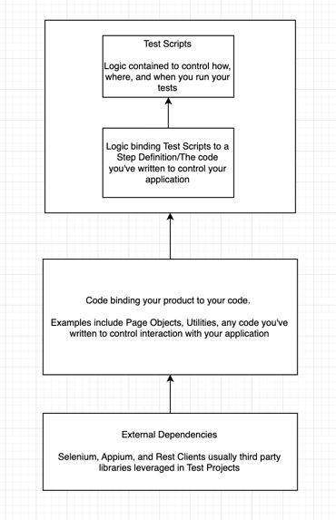

# Sdet-Architect

## Purpose

The purpose of this project is to show the types of projects and technologies I've worked on and written pertaining to software testing.  I want to do this so I can architect Software testing solutions.

All the work here I've either written from scratch or worked within heavily, and should understand to a high degree.

## Quality in the Context of Automated Software Testing

Quality in the context of Software testing is simply a standard. It's a standard we hold for our users, customers, stakeholders, ourselves, and the greater marketplace as a whole.

We can measure it in two ways: Quantitatively and Qualitatively.

- Quantitave quality refers to countable, measurable metrics: does a Web Application page load? Do I get a 200 response code from an API? etc. 

- Qualitative quality refers to standards that are subject to interpretation, and can even require intuition to understand.  As often the first "users" of an application, software testers need to anticipate scenarios confuse and give actual users wrong impressions.  For example, imagine if Google/Apple correct dark skin bias in smartphone technology in initial phases of development ahead of each other? Do they gain greater market shares earlier in the perennial phone where? Food for thought. 

Further discplines of Software testing such as Security Testing and Performance testing are simply combinations of the two:  

- Performance testing tools like Locust provide quantitative response times and failure rates we need to qualitatively determine whether they pass muster
- Security tools like OWASP Quantitativly can help determine if your website is secure or not versus a qualitative standard
- Accessibility standards like WCAG are Qualitative standards executed Quantitatively

The list goes on and on, but time is finite. 

Automated Software Testing helps us organizations and departments by cutting into the time it takes us to assess our applications on a variety of levels.

## Overall Methodology in Testing Automation Structure

For the most part, all Software Testing Projects consist of 3 to 4 parts(depending on how you look at it):

The 4 parts include Test Scripts, Step Definition, Application Control, and External Dependencies. Some tools combine all of these in one, but usually those have a cost associated with them.

### Test Scripts
Starting at the top, Test Scripts define what your tests will do and how they will run. For example, if you have chosen to use Cucumber to run your tests, at the highest level, your tests will look like this:

## Web Application Software Automation

At all phases of my career I have worked